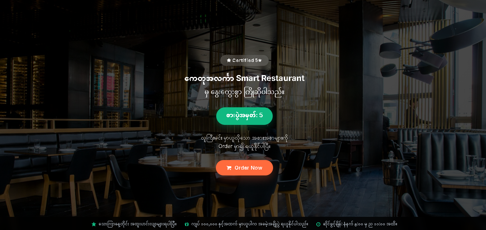
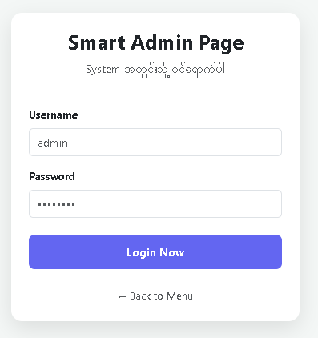
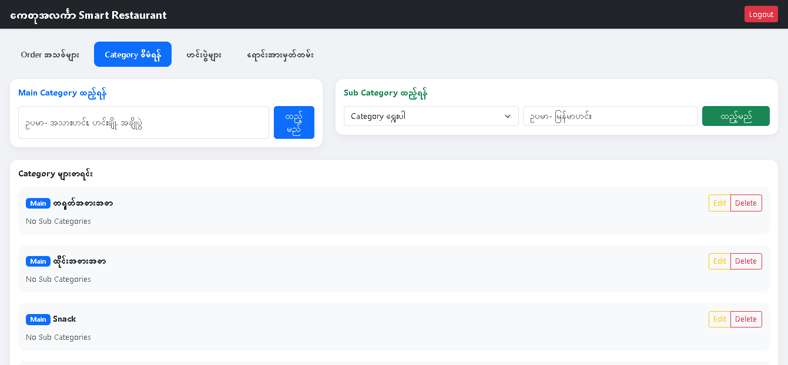
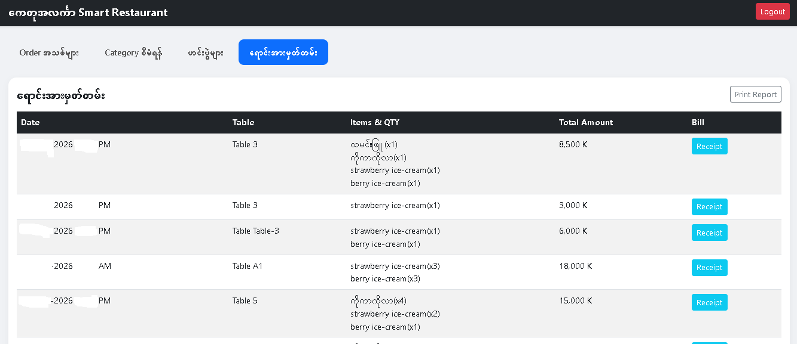
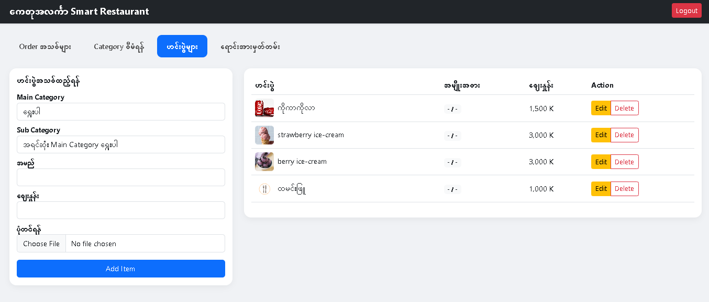
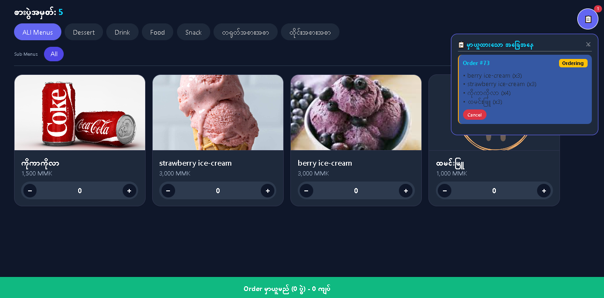
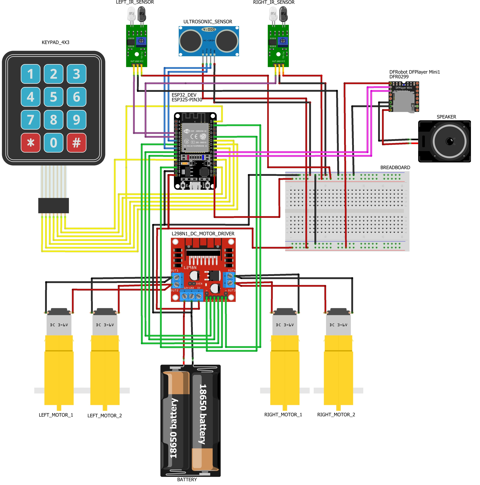

## Smart Restraunt Management System Screenshots

### User View

### admin_login

### manage_category

### manage_sell

### manage_menu

### order

### Circuit_Diagram

---

# Smart Restaurant Management System (SRMS)

> IoT-Based Smart Restaurant Management System using ESP32, QR Code Ordering, Web-Based Restaurant Management, and Autonomous Food Delivery Robot.

---

## Overview

Smart Restaurant Management System (SRMS) သည် Restaurant တစ်ခုအတွက် Digitalized ပြုလုပ်နိုင်ရန် IoT, Web Technologies နှင့်ပေါင်းစပ်တည်ဆောက်ထားသော စနစ်ဖြစ်ပါတယ်။

Customer များသည် Restaurant WiFi သို့ ချိတ်ဆက်ပြီး Table အလိုက် သတ်မှတ်ထားသော QR Code ကို Scan ဖတ်ကာ Web-app ထဲသို့ ဝင်ရောက်နိုင်ပါတယ်။
ထို့နောက် Menu များကို ကြည့်ရှု၍ Order တင်နိုင်ပြီး Order Ready မဖြစ်မချင်း Cancel ပြုလုပ်နိုင်ပါတယ်။

Admin/Chef ဘက်မှ Order များကို စီမံခန့်ခွဲနိုင်ပြီး Categories, Sub Categories, Menu Items, Sales Management နှင့် Bill Printing တို့ကို Web Dashboard မှတစ်ဆင့် ဆောင်ရွက်နိုင်ပါတယ်။

ထို့အပြင် ESP32 အခြေပြု Autonomous Delivery Robot ကို အသုံးပြုထားပြီး Line Following Technology ဖြင့် Table 1, Table 2, Table 3 နှင့် Table 4 များသို့ အစားအသောက်များကို အလိုအလျောက် ပို့ဆောင်ပေးနိုင်ပါတယ်။

---

## System Workflow

### 1. Customer Access

* Customer က Restaurant WiFi သို့ ချိတ်ဆက်ပါမယ်။
* Table QR Code ကို Scan ဖတ်မယ်။
* Restaurant Web Application သို့ ဝင်ရောက်ပါမယ်။
* Menu များကို ကြည့်ရှုနိုင်ပါမယ်။

### 2. Order Placement

* Customer မှ Menu ကို ရွေးချယ်နိုင်မယ်။
* Order တင်သွင်းမယ်။
* Order Information ကို Database တွင် သိမ်းဆည်းမယ်။
* Admin Dashboard တွင် Real-time ပြသပါမယ်။

### 3. Order Cancellation

* Chef/Admin မှ Ready မပြုလုပ်သေးသရွေ့ Customerက Order ကို Cancel ပြုလုပ်နိုင်ပါမယ်။

### 4. Order Preparation

* Chef/Admin မှ Order ကို စစ်ဆေးနိုင်ပါမယ်။
* Order Ready Status သို့ ပြောင်းသွားမယ်။
* Customer ထံ Notification ပြသပါမယ်။

### 5. Food Delivery Robot

* ESP32 Robot မှတဆင့် Order Table ကို နံပါတ်အလိုက် နှိပ်လျှင် Line Following စနစ်ဖြင့် လမ်းကြောင်းအတိုင်း သွားမယ်။
* Marker Detection ဖြင့် Table ကို ခွဲခြားသတ်မှတ်ထားပါတယ်။
* သက်ဆိုင်ရာ Table သို့ အစားအသောက် ပို့ဆောင်ပေးပါမယ်။
* Delivery ပြီးပါက Starting Point သို့ ပြန်လာမယ်။

---

## Admin Features

### Category Management

* Add Categories
* Update Categories
* Delete Categories

### Sub Category Management

* Add Sub Categories
* Update Sub Categories
* Delete Sub Categories

### Menu Management

* Add Menu Items
* Edit Menu Items
* Delete Menu Items
* Manage Prices

### Sales Management

* View Sales Records
* Daily Sales Report
* Order History

### Billing System

* Generate Bills
* Print Bills
* Manage Transactions

---

## Customer Features

* Connect Restaurant WiFi
* Scan QR Code
* View Menu
* Place Order
* Cancel Order
* Track Order Status
* Receive Ready Notification

---

## Robot Features

* Autonomous Navigation
* Line Following
* Marker Detection
* Table Recognition
* Automatic Food Delivery
* Return-to-Base Function

---

## Technologies Used

### Software

* PHP
* MySQL
* HTML5
* CSS3
* JavaScript
* Bootstrap
* AJAX
* API
* XAMPP

### Hardware

* ESP32 Dev Module
* IR Sensors (Line Following)
* Ultrasonic Sensor
* DFPlayer Mini
* Speaker
* Keypad
* L298N Motor Driver
* 4WD Robot Chassis
* DC Motors
* Marker Detection System

---

## Audio Notification System

DFPlayer Mini နှင့် Speaker ကို အသုံးပြု၍

* Welcome Message
* Order Ready Notification
* Delivery Complete Notification

များကို အသံဖြင့် ထုတ်ပြန်နိုင်ပါတယ်။

---

## Future Improvements

* Mobile Application
* Online Payment Integration
* AI Recommendation System
* Voice Ordering System
* RFID Customer Identification
* Cloud Database
* Real-Time Mobile Notifications
* Multiple Delivery Robots

---

## License

This project is developed for educational and research purposes only.
All Rights Reserved.
